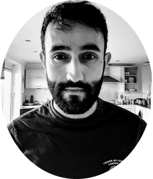

## Career

Software Engineer. Python. Django.

## Education

Physics MSc, University College London, 2015-17.  

Mathematics and Physics BSc, University of Warwick, 2012-15.

### Publications

1. [Analytic quantum-interference conditions in Coulomb corrected photoelectron holography](https://iopscience.iop.org/article/10.1088/1361-6455/aa9e81)  
Journal of Physics B: Atomic, Molecular and Optical Physics  
A. S. Maxwell, A. Al-Jawahiry, X. Y. Lai, and C. Figueira de Morisson Faria  
Jan 26, 2018 

2. [Coulomb-corrected quantum interference in above-threshold ionization: Working towards multitrajectory electron holography.](https://journals.aps.org/pra/abstract/10.1103/PhysRevA.96.023420)  
APS Physical Review A  
A. S. Maxwell, A. Al-Jawahiry, T. Das, and C. Figueira de Morisson Faria  
Aug 22, 2017  

### Honors & Awards

1. Harrie Massey Prize for best overall UCL Physics and Astronomy MSc Student
2. Nominated for the Mathematical and Physical Sciences Faculty Postgraduate prize
